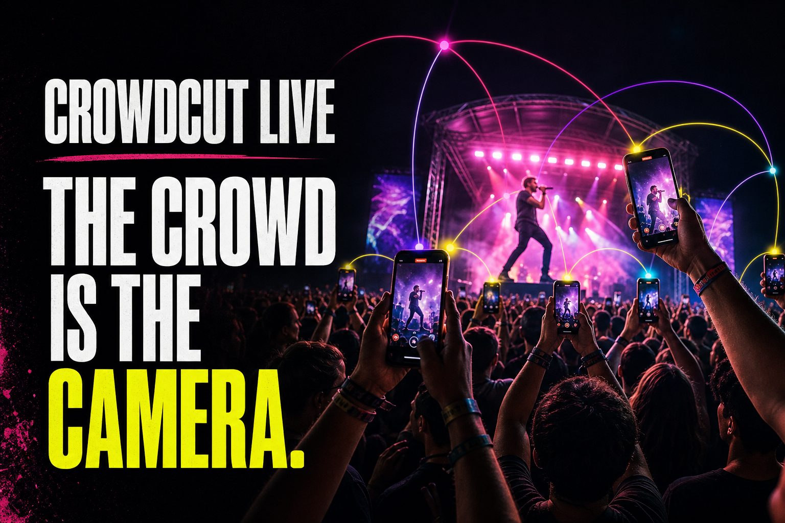
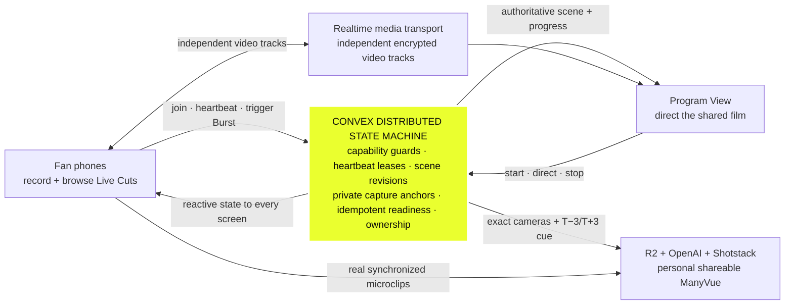
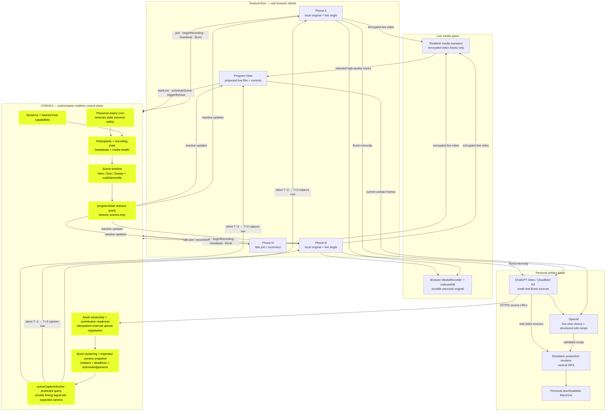
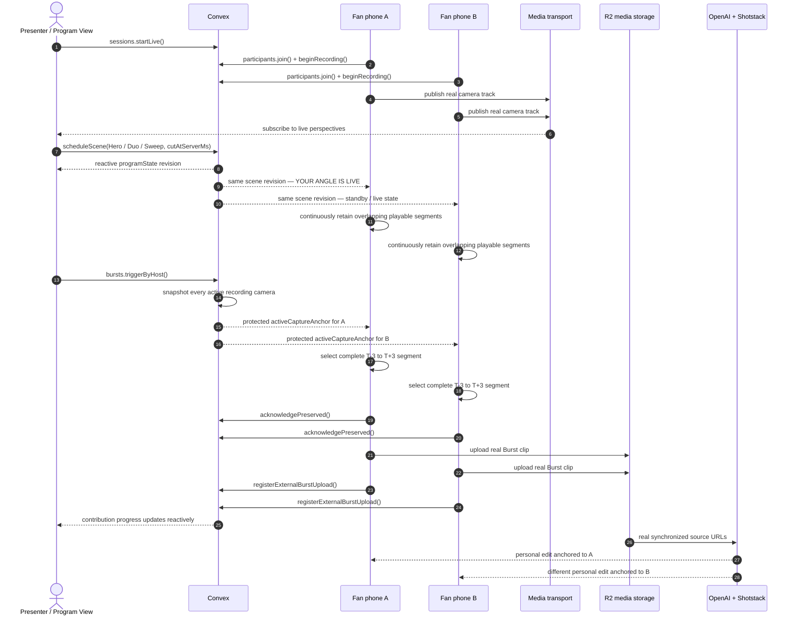

<p align="center">
  
</p>

<h1 align="center">ManyVue Live</h1>

<p align="center">
  <strong>Record your angle. See it go live. Take home the crowd.</strong>
</p>

<p align="center">
  <a href="https://manyvue-live.ild.chatgpt.site/"><strong>Open the live experience ↗</strong></a>
  ·
  <a href="#the-convex-centered-architecture">Architecture</a>
  ·
  <a href="#run-the-live-demo">Demo flow</a>
  ·
  <a href="#run-locally">Run locally</a>
  ·
  <a href="docs/ARCHITECTURE_DEMO_SCRIPT.md">15-second architecture script</a>
  ·
  <a href="output/pdf/ManyVue_Next_Steps.pdf">Festival roadmap</a>
</p>

ManyVue turns the phones already recording a concert into one synchronized camera crew. Fans keep their own original recording, watch their perspective enter a shared live production, capture a musical instant across every active phone, and receive a personal multi-angle film made from the real crowd around them.

Built for the **OutsideLLMs / Outside Lands** fan-experience challenge, with **Convex as the realtime control plane** coordinating the room.

## The product in one minute

1. The presenter opens the Program View and starts a live film.
2. Fans scan one QR code—no account or app install—and tap **Start My Angle**.
3. Every fan gets **Live Cuts**: a private realtime gallery of every connected angle. They can open any view full screen and return to **My Angle** without changing the shared production.
4. On the Program View, clicking a camera immediately shows it live. A separate **+ Multiview** control builds deliberate 2–5 angle compositions without conflating browsing and directing.
5. When a phone appears in the shared film, that exact participant sees **Your Angle Is Live** and can feel a haptic confirmation.
6. Anyone can trigger **Burst This Moment**. Every recording phone captures the same shared cue from its physical position while its full personal recording continues uninterrupted.
7. Each Burst initiator receives a distinct, vertical ManyVue assembled from their angle and the other real perspectives, while every contributing camera can open the synchronized replay.

This is not a heatmap, a wall of surveillance feeds, or a generic video-upload editor. The shared film exists **while the event is happening**, and every person’s physical place in the crowd changes the result they take home.

## Four connected experiences

### 1. Start My Angle

The camera opens directly from the QR link. A fan declares whether they are left, center, or right of the stage, then starts recording. Their full-resolution original remains on their device while a live video track enters the room.

While recording, **Live Cuts** shows every connected phone as a realtime visual gallery. Opening an angle is private to that attendee: it never changes the Program View, sends a director command, or interrupts their recording. **My Angle** returns directly to their own camera.

### 2. Live Crowd Director

The projected Program View is one deliberate production—not a dashboard. It supports:

- **Click to view live** — click any camera tile to show that angle immediately on the Program View.
- **1–5 angle Multiview** — use the separate add control to choose exact cameras in order, then hold them simultaneously in a production composition.
- **Slow Sweep** — a polished crossfade, directional wipe, and dolly through selected phones that lands on a deliberate hero.
- **Auto Director** — Convex selects healthy, stage-diverse cameras on a predictable live cadence.

The camera selected by the room and the phone receiving the live confirmation are driven by the same authoritative scene revision.

### 3. Crowd Burst

The presenter or any recording attendee can tap a Burst immediately—there is no room-wide countdown. From the instant **Start My Angle** begins, each phone continuously maintains overlapping, independently playable low-bitrate recordings. Convex snapshots the eligible camera set at tap time and reactively fans out one shared anchor.

Every eligible phone silently:

- selects the complete rolling segment containing exactly **T−3 seconds through T+3 seconds**;
- acknowledges that its real footage exists;
- uploads its small Burst source without stopping the main recording;
- registers the asset against the correct participant and Burst; and
- contributes its source without interrupting or changing its live camera UI.

Only the device that tapped receives the Burst capture feedback. The Program View and every other camera keep showing exactly what they were already showing.

**View Bursts** is available on every camera and the Program View. It places the viewer's saved angle—or the Program's lead angle—at the top, with every other saved perspective in a gallery underneath. **Play All Angles** seeks every clip to the same `T−3` point and starts them together as a synchronized multiview.

### 4. My ManyVue

Once at least two real sources arrive, the Burst initiator gets a personalized edit:

- the owner’s camera anchors the cut;
- OpenAI returns a schema-validated edit recipe;
- Shotstack renders a real 9:16 MP4 from the uploaded footage; and
- the attendee can download the finished ManyVue or their untouched original.

AI directs the footage. It does not fabricate the event.

## The Convex-centered architecture

> **Convex is the authoritative distributed coordination layer for the entire production.**

Convex models ManyVue as a capability-guarded, auditable state machine. Everything that makes independently connected phones behave like one coherent production—leased presence, recording state, revisioned scene selection, server-timed cuts, synchronized Burst membership, contribution readiness, asset provenance, and personal ownership—is committed and reactively distributed through Convex.

### Convex in one glance

This is the screen-ready version: **every mutation advances authoritative production state, and every subscribed client converges on that state without polling**.



The media path can scale or change providers without changing the product's shared truth. Remove Convex and there is no coherent crew, no authoritative live cut, no exact shared Burst, and no trustworthy per-person artifact.

### Detailed production architecture



### What Convex visibly controls

| Convex responsibility | Concrete implementation | What the audience sees |
| --- | --- | --- |
| Session lifecycle | `sessions.create`, `startLive`, `endLive` | One QR opens the correct live production; late joins do not restart it; **Stop Film** ends the session and safely closes recording cameras. |
| Anonymous secure participation | Random participant/host capabilities are SHA-256 hashed before storage | A fan joins in one tap without accounts, while privileged host mutations remain protected. |
| Realtime camera presence | `beginRecording`, sequenced heartbeats, media health, and a five-second expiry cron | New phones appear live; stopped or stale phones disappear without breaking the film. |
| Authoritative direction | `scheduleScene` and `scheduleAutoScene` commit a layout, camera IDs, revision, and future `cutAtServerMs` | The Program View switches perspectives while the selected phone receives its live state from the same revision. |
| Reactive director fan-out | Every screen subscribes to `director.programState` with `ConvexClient.onUpdate` | Joins, cuts, and reconnects arrive without polling; a participant Burst cannot mutate the Program View. |
| Private Burst fan-out | Each recording camera subscribes to capability-protected `bursts.activeCaptureAnchor` | Only expected cameras receive the immutable timing cue; passive contributors upload silently while only the initiator sees feedback. |
| Burst coordination | `trigger` / `triggerByHost` snapshot every active recording camera—including a published host angle—and create contribution records | One action preserves every real view at the same moment without switching the live film. |
| Truthful contribution state | `acknowledgePreserved` distinguishes locally preserved footage from uploaded footage | “Captured” and “uploaded” are real states, not optimistic animation. |
| Asset provenance | `registerExternalBurstUpload` binds an HTTPS clip to its authenticated participant and Burst | Personal edits use only the cameras that actually contributed to that moment. |
| Idempotency and ordering | Client sequence numbers, scene idempotency keys, Burst marker IDs, and stable asset IDs | Retries and reconnects do not create duplicate people, cuts, clips, or renders. |

### Why removing Convex removes the product

Without Convex, ManyVue would degrade into unrelated livestreams and uploaded clips. There would be no authoritative answer to:

- Which phones currently constitute the camera crew?
- Which angle is on air, and which specific phone must react?
- When should every screen apply the next cut?
- Which recording phones belong to a Burst triggered at this instant?
- Which clips are preserved, uploaded, duplicated, expired, or ready?
- Which shared sources belong inside each participant’s personal artifact?

Convex is not a database attached after the interesting work. It is the distributed production room that makes the interesting work coherent.

## Realtime event flow



## Data model

The Convex schema records the production as a sequence of explicit, auditable state transitions:

| Table | Purpose |
| --- | --- |
| `sessions` | Live/lobby/ended lifecycle, stage metadata, host capability hash, current scene revision. |
| `participants` | Anonymous camera identity, role, presence, recording state, health, and stage-relative shot metadata. |
| `scenes` | Immutable directed takes with layout, selected participants, source, reason, revision, and scheduled cut time. |
| `bursts` | Shared moment anchor, capture window, deadline, expected cameras, marker count, and readiness totals. |
| `burstMarkers` | Idempotent record of who triggered or joined a Burst. |
| `burstContributions` | Per-camera requested → preserved → uploading → ready state. |
| `assets` | Ownership and provenance for original clips, Burst clips/frames, and rendered output. |
| `renderJobs` / `renderEvents` | Idempotent, monotonic production-render workflow and verified provider events. |

Indexes cover the hot realtime paths: session slug, participant/session membership, presence age, scene revision/idempotency, Burst time/status, per-participant contribution, asset ownership, and provider render IDs.

## Run the live demo

The live deployment is [manyvue-live.ild.chatgpt.site](https://manyvue-live.ild.chatgpt.site/).

1. Open the URL on the laptop connected to the main display.
2. Click **Start Film**.
3. Expand the persistent QR code and scan it with at least two phones.
4. On each phone, choose its physical stage side and tap **Start My Angle**.
5. On a phone, open **Live Cuts**, see every connected angle, tap one to watch it privately, then tap **My Angle** to return. The Program View does not change.
6. On the laptop, click any camera tile to show it immediately. Use **+ Multiview** to select exact tiles, then hold **1, 2, 3, 4, or 5 angles** together; try **Slow Sweep** and **Auto Director**.
7. Watch a shown phone change to **Your Angle Is Live**.
8. Click **Burst All Angles** on the Program View—or **Burst This Moment** on any recording phone.
9. The tapping device confirms its Burst while every other phone silently preserves and uploads its matching `T−3 → T+3` source; all full recordings continue.
10. Open **View Bursts** on a phone or the laptop. The owner's angle appears first, every other angle appears below, and **Play All Angles** replays them together.
11. Click **Stop Film** on the laptop to end the Convex session and safely finalize active camera recordings.

The host Burst button intentionally remains disabled until a real attendee camera is recording. A finished multi-angle artifact requires at least two uploaded perspectives.

## Media and sound behavior

- Phone microphones are recorded into their local personal footage.
- Phone microphone tracks are **not** published into the shared Program View, preventing multi-device echo and feedback.
- The laptop can play the room’s continuous soundtrack independently.
- Full personal recordings stay device-local; only small Burst sources are uploaded for collaborative editing.
- Full-screen camera presentation uses the sensor’s uncropped field of view. Multiview thumbnails may crop only for compact monitoring.

## Run locally

### Requirements

- Node.js `>=22.13.0`
- A Convex deployment
- LiveKit Cloud credentials
- OpenAI API access
- Shotstack production rendering credentials

### Install and start

```bash
git clone https://github.com/ElijahUmana/ManyVue.git
cd ManyVue
npm install
cp .env.example .env.local
```

Configure `.env.local`, then run Convex and the web application:

```bash
npx convex dev
npm run dev
```

Open `http://localhost:3000` for the Program View. Its QR code generates the matching camera URL automatically.

### Environment variables

| Variable group | Purpose |
| --- | --- |
| `CONVEX_DEPLOYMENT`, `CONVEX_URL`, `NEXT_PUBLIC_CONVEX_URL` | Convex deployment and browser subscription endpoint. |
| `CONVEX_DEPLOY_KEY` | Server/CLI deployment authorization; never expose it to the client. |
| `LIVEKIT_URL`, `LIVEKIT_API_KEY`, `LIVEKIT_API_SECRET` | Token issuance and realtime WebRTC room access. |
| `NEXT_PUBLIC_LIVEKIT_URL` | Public LiveKit websocket endpoint. |
| `OPENAI_API_KEY`, `OPENAI_MODEL` | Live vision direction and structured edit recipes. |
| `SHOTSTACK_API_KEY`, `SHOTSTACK_API_BASE_URL` | Production MP4 rendering and status verification. |
| `SHOTSTACK_WEBHOOK_URL`, `SHOTSTACK_WEBHOOK_TOKEN` | Authenticated render completion callback. |
| `JAMBASE_API_KEY`, `JAMBASE_API_BASE_URL` | Optional live festival/set metadata. |

Never commit `.env.local`; environment files are ignored by Git.

## Verification

```bash
npm run typecheck
npm run lint
npm test
npm run build
```

The focused test suite covers exact rolling `T−3 → T+3` coverage, overlapping segment cadence and upload headroom, automatic direction, scene scheduling, Burst clustering, mobile presence jitter, media upload idempotency, Safari contact-sheet fallback, and edit-recipe validation.

## Project map

```text
app/
├── ManyVueApp.tsx                 # Program View + attendee camera experience
├── BurstLibrary.tsx                # Owner-first synchronized saved Burst replay
└── api/
    ├── ai/                         # Live director + personal edit recipe
    ├── artifacts/                  # Shotstack render/status/webhook
    ├── livekit-token/              # Server-side LiveKit token issuance
    └── uploads/                    # R2 Burst source storage

convex/
├── schema.ts                       # Authoritative data model + indexes
├── sessions.ts                     # Session lifecycle + host authority
├── participants.ts                 # Join, presence, recording, health
├── director.ts                     # Reactive program state + scene commits
├── bursts.ts                       # Shared Burst transaction + acknowledgements
├── assets.ts                       # Authenticated asset provenance/readiness
├── renderJobs.ts                   # Idempotent render state machine
└── crons.ts                        # Stale-camera expiry

lib/
├── ai/                             # Validated director/edit contracts
├── artifacts/                      # R2, Shotstack, JamBase adapters
├── media/                          # Durable originals + continuous rolling Burst recorder
└── realtime/                       # Presence, scene, Burst, auto-director logic
```

## Security and correctness choices

- Host and participant capabilities are random tokens; only SHA-256 hashes are stored in Convex.
- Mutations validate session ownership, participant ownership, recording state, and camera eligibility.
- Client sequence numbers reject stale heartbeat/recording writes.
- Idempotency keys make duplicate scene, marker, asset, and render operations safe.
- Stale presence is expired by a Convex cron, while a bounded recovery window tolerates mobile timer throttling.
- Shotstack callbacks are token-checked and verified against the authenticated provider API before any state transition.
- OpenAI output is schema-validated before it can become a production render.
- Failures remain visible; a failed collaborative artifact never invalidates the attendee’s locally saved original.

## Technology

- **Convex** — authoritative realtime state, subscriptions, transactions, cron presence, and capability-guarded mutations
- **LiveKit** — WebRTC/SFU live camera transport
- **OpenAI** — multimodal live shot selection and structured edit planning
- **Shotstack** — production vertical MP4 rendering
- **ChatGPT Sites / Cloudflare** — application hosting and R2 media storage
- **React, TypeScript, vinext** — camera and production interfaces

---

**One person records a clip. A crowd creates the film.**
