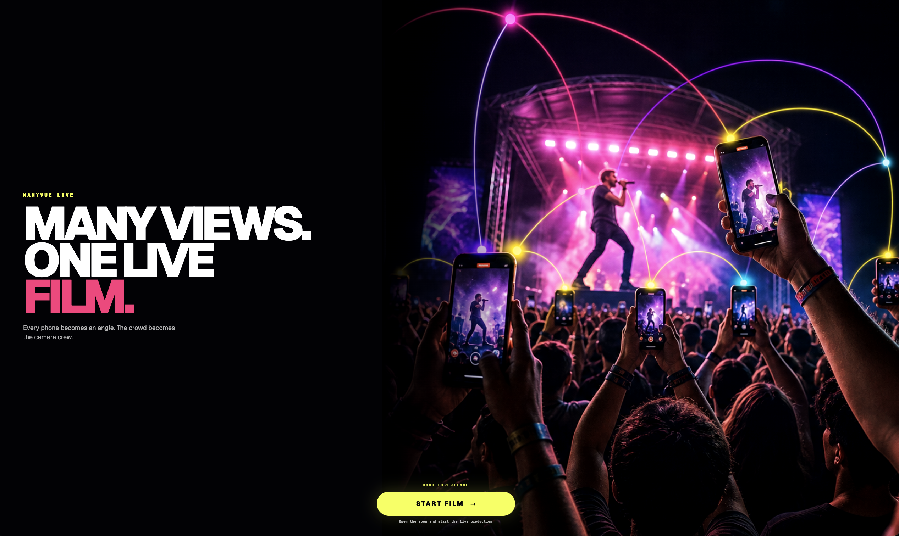
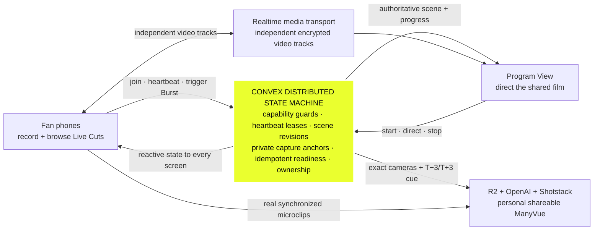
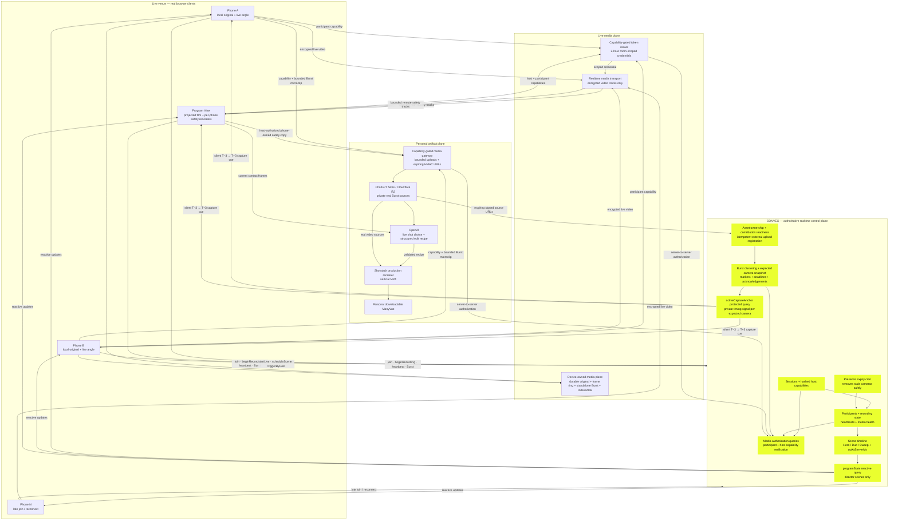
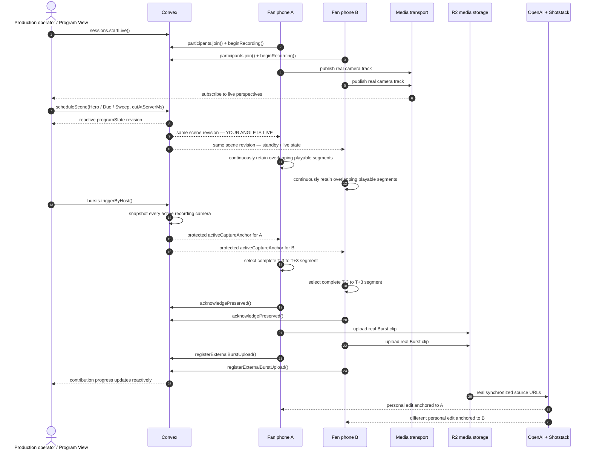

<p align="center">
  
</p>

<h1 align="center">ManyVue Live</h1>

<p align="center">
  <strong>Record your angle. See it go live. Take home the crowd.</strong>
</p>

<p align="center">
  <a href="https://manyvue-live.ild.chatgpt.site/"><strong>Open the live experience ↗</strong></a>
  ·
  <a href="#the-convex-centered-architecture">Architecture</a>
  ·
  <a href="#operate-a-live-production">Operations</a>
  ·
  <a href="#run-locally">Run locally</a>
</p>

ManyVue turns the phones already recording a concert into one synchronized camera crew. Fans keep their own original recording, watch their perspective enter a shared live production, capture a musical instant across every active phone, and receive a personal multi-angle film made from the real crowd around them.

**Convex is the realtime control plane** coordinating live participants, authoritative program state, synchronized capture, media provenance, and personalized artifact readiness across the room.

## How the production works

1. The production operator opens the Program View and starts a live film.
2. Fans scan one QR code—no account or app install. The browser asks for Camera once; tapping **Allow** immediately publishes, records, and primes Burst capture without a second start action.
3. Every fan gets **Live Cuts**: a private realtime gallery of every connected angle. They can open any view full screen and return to **My Angle** without changing the shared production.
4. On the Program View, clicking a camera immediately shows it live. A separate **+ Multiview** control builds deliberate 2–5 angle compositions without conflating browsing and directing.
5. When a phone appears in the shared film, that exact participant sees **Your Angle Is Live** and can feel a haptic confirmation.
6. Anyone can trigger **Burst This Moment**. Every recording phone captures the same shared cue from its physical position while its full personal recording continues uninterrupted.
7. Each Burst initiator receives a distinct, vertical ManyVue assembled from their angle and the other real perspectives, while every contributing camera can open the synchronized replay.

This is not a heatmap, a wall of surveillance feeds, or a generic video-upload editor. The shared film exists **while the event is happening**, and every person’s physical place in the crowd changes the result they take home.

## Four connected experiences

### 1. Allow once; become an angle

The camera opens directly from the QR link. ManyVue requests Camera once; the same permission promise continues directly into transport authorization, live publication, durable local recording, and rolling Burst priming. If the browser retained the grant, a returning phone rejoins automatically. If the user or OS revoked it, the interface fails visibly and offers one explicit **Join Camera** recovery action—it never pretends access exists.

Each phone starts with a deterministic left/center/right position and can correct it while recording. The update reaches both Convex shot metadata and the live participant label, so stage-aware direction keeps using the attendee's real position. Their original remains on the device while an independent live video track enters the room.

While recording, **Live Cuts** shows every connected phone as a realtime visual gallery. Opening an angle is private to that attendee: it never changes the Program View, sends a director command, or interrupts their recording. **My Angle** returns directly to their own camera.

### 2. Live Crowd Director

The projected Program View is one deliberate production—not a dashboard. It supports:

- **Click to view live** — click any camera tile to show that angle immediately on the Program View.
- **1–5 angle Multiview** — use the separate add control to choose exact cameras in order, then hold them simultaneously in a production composition.
- **Slow Sweep** — a polished crossfade, directional wipe, and dolly through selected phones that lands on a deliberate hero.
- **Auto Director** — Convex selects healthy, stage-diverse cameras on a predictable live cadence.

The camera selected by the room and the phone receiving the live confirmation are driven by the same authoritative scene revision.

Host-camera publication has its own critical path: permission, media publication, and immediate Program View insertion complete before Convex scene scheduling or Burst priming. A control-plane or recorder failure can degrade those secondary capabilities, but it cannot remove a valid host video feed.

### 3. Crowd Burst

The production operator or any recording attendee can tap a Burst immediately—there is no room-wide countdown. From the instant Camera permission resolves, each phone writes its complete original to IndexedDB and maintains a compressed in-memory frame ring independent of browser MediaRecorder chunk behavior. Convex snapshots the eligible camera set at tap time and reactively fans out one shared anchor.

Every eligible phone silently:

- selects real retained frames from exactly **T−3 seconds through T+3 seconds**;
- encodes those frames into a new standalone, locally playable six-second video;
- persists that personal Burst to IndexedDB and exposes an immediate local download;
- acknowledges that its real footage exists;
- uploads its small Burst source without stopping the main recording;
- registers the asset against the correct participant and Burst; and
- contributes its source without interrupting or changing its live camera UI.

Only the device that tapped receives the Burst capture feedback. The Program View and every other camera keep showing exactly what they were already showing.

The Program View simultaneously maintains a bounded low-bitrate safety recorder for every live track, including the host. At T+3 it finalizes the exact covering segment immediately, uploads the playable source, and marks the Convex contribution ready. Metadata probing and contact-sheet extraction run afterward, so optional enrichment cannot delay angle availability. A protected Convex host capture cue can persist the same phone-owned asset when a mobile encoder fails, without replacing or weakening the phone's device-owned original and local Burst.

**View Bursts** is available on every camera and the Program View. It places the viewer's saved angle—or the Program's lead angle—at the top, with every other saved perspective in a gallery underneath. **Play All Angles** seeks every clip to the same `T−3` point and starts them together as a synchronized multiview.

### 4. My ManyVue

Once at least two real sources arrive, the Burst initiator gets a personalized edit:

- the owner’s camera anchors the cut;
- OpenAI returns a schema-validated edit recipe;
- Shotstack renders a real 9:16 MP4 from the uploaded footage; and
- the attendee can download the finished ManyVue or their untouched original.

AI directs the footage. It does not fabricate the event.

## The Convex-centered architecture

> **Convex is the authoritative distributed coordination layer for the entire production.**

Convex models ManyVue as a capability-guarded, auditable state machine. Everything that makes independently connected phones behave like one coherent production—leased presence, recording state, revisioned scene selection, server-timed cuts, synchronized Burst membership, contribution readiness, asset provenance, and personal ownership—is committed and reactively distributed through Convex.

### Convex in one glance

This is the screen-ready version: **every mutation advances authoritative production state, and every subscribed client converges on that state without polling**.



The media path can scale or change providers without changing the product's shared truth. Remove Convex and there is no coherent crew, no authoritative live cut, no exact shared Burst, and no trustworthy per-person artifact.

### Detailed production architecture



### What Convex visibly controls

| Convex responsibility | Concrete implementation | What the audience sees |
| --- | --- | --- |
| Session lifecycle | `sessions.create`, `startLive`, `endLive` | One QR opens the correct live production; late joins do not restart it; **Stop Film** ends the session and safely closes recording cameras. |
| Anonymous secure participation | Random participant/host capabilities are SHA-256 hashed before storage | A fan joins in one tap without accounts, while privileged host mutations remain protected. |
| Realtime camera presence | Device heartbeats plus host-authorized `confirmVisibleMedia` leases from the actual Program media wall | Browser timer throttling cannot remove a track that the production computer is visibly receiving; stopped tracks still expire safely. |
| Media-plane authorization | `authorizeLiveMedia`, `authorizeProgramMedia`, `authorizeParticipantMedia`, `authorizeHostMedia`, and `authorizeHostContributionMedia` re-check hashed capabilities server-to-server | Editing a URL cannot impersonate another camera, mint a room token, upload a fake angle, or list somebody else's Burst. |
| Authoritative direction | `scheduleScene` and `scheduleAutoScene` commit a layout, camera IDs, revision, and future `cutAtServerMs` | The Program View switches perspectives while the selected phone receives its live state from the same revision. |
| Reactive director fan-out | Every screen subscribes to `director.programState` with `ConvexClient.onUpdate` | Joins, cuts, and reconnects arrive without polling; a participant Burst cannot mutate the Program View. |
| Private Burst fan-out | Cameras subscribe to `bursts.activeCaptureAnchor`; the Program View independently subscribes to `activeProgramCaptureAnchor` | Expected phones receive the immutable timing cue, while the host can preserve a redundant copy of the same phone-owned source without changing the live film. |
| Burst coordination | `trigger` / `triggerByHost` renew the initiating device lease, snapshot every active recording camera—including a published host angle—and create contribution records | Encoder load or heartbeat throttling cannot silently omit the camera that visibly triggered the moment. |
| Truthful contribution state | `acknowledgePreserved` distinguishes locally preserved footage from uploaded footage | “Captured” and “uploaded” are real states, not optimistic animation. |
| Asset provenance | `registerExternalBurstUpload` and `registerExternalBurstUploadByHost` bind one stable object identity to the expected participant and Burst | Local and mirrored retries converge on one phone-owned asset instead of creating duplicates. |
| Idempotency and ordering | Client sequence numbers, scene idempotency keys, Burst marker IDs, and stable asset IDs | Retries and reconnects do not create duplicate people, cuts, clips, or renders. |

### Production invariants and operating envelope

These are enforced constants or authorization boundaries, not aspirational metrics:

| Invariant | Enforced value | Why it exists |
| --- | ---: | --- |
| Presence heartbeat | every **4 seconds** | Keeps live camera membership reactive without a noisy polling UI. |
| Strict stale-camera cutoff | **20 seconds** | Tolerates ordinary mobile timer jitter while evicting dead camera rows. |
| Manual scene lead | **600 ms** by default | Gives subscribed screens time to apply the same scene revision together. |
| Active composition | **1–5 selected angles** | Covers hero through dense multiview while keeping every tile legible. |
| Burst window | exactly **T−3s → T+3s** | Preserves anticipation and reaction around the attendee's tap. |
| Burst cluster window | **1.5 seconds** | Nearby independent taps share one real moment without moving its original anchor. |
| Burst contribution deadline | **8 seconds** | Bounds collection and prevents abandoned cameras from holding an artifact forever. |
| Device frame ring | **12 FPS**, retaining **7.5 seconds** continuously | Keeps T−3 frames alive until T+3 finishes, without depending on Safari or Chrome MediaRecorder timeslice behavior. |
| Local Burst output | standalone **T−3s → T+3s** recording persisted to IndexedDB | Every phone owns a directly playable and downloadable personal Burst before network upload. |
| Program safety segments | **9 seconds**, opened every **3 seconds**, finalized at **T+3** | Makes every live angle uploadable at the earliest truthful instant without replacing device-owned capture. |
| Burst gallery refresh | every **700 ms** while sources are missing | Exposes newly ready angles quickly without continuously polling completed moments. |
| Burst source ceiling | **1.8 MB ingress**, bounded low-bitrate sources | Keeps uploads reliable on congested event networks and below the deployed edge boundary. |
| Signed replay URL | **24-hour HMAC lease** | Renderers can fetch a real source without making the storage bucket enumerable or public. |
| Room credential | **2-hour**, room- and identity-scoped | Prevents arbitrary cross-room publication while surviving a complete set. |

### Why removing Convex removes the product

Without Convex, ManyVue would degrade into unrelated livestreams and uploaded clips. There would be no authoritative answer to:

- Which phones currently constitute the camera crew?
- Which angle is on air, and which specific phone must react?
- When should every screen apply the next cut?
- Which recording phones belong to a Burst triggered at this instant?
- Which clips are preserved, uploaded, duplicated, expired, or ready?
- Which shared sources belong inside each participant’s personal artifact?

Convex is not a database attached after the interesting work. It is the distributed production room that makes the interesting work coherent.

## Realtime event flow



## Data model

The Convex schema records the production as a sequence of explicit, auditable state transitions:

| Table | Purpose |
| --- | --- |
| `sessions` | Live/lobby/ended lifecycle, stage metadata, host capability hash, current scene revision. |
| `participants` | Anonymous camera identity, role, presence, recording state, health, and stage-relative shot metadata. |
| `scenes` | Immutable directed takes with layout, selected participants, source, reason, revision, and scheduled cut time. |
| `bursts` | Shared moment anchor, capture window, deadline, expected cameras, marker count, and readiness totals. |
| `burstMarkers` | Idempotent record of who triggered or joined a Burst. |
| `burstContributions` | Per-camera requested → preserved → uploading → ready state. |
| `assets` | Ownership and provenance for original clips, Burst clips/frames, and rendered output. |
| `renderJobs` / `renderEvents` | Idempotent, monotonic production-render workflow and verified provider events. |

Indexes cover the hot realtime paths: session slug, participant/session membership, presence age, scene revision/idempotency, Burst time/status, per-participant contribution, asset ownership, and provider render IDs.

## Operate a live production

The deployed application is [manyvue-live.ild.chatgpt.site](https://manyvue-live.ild.chatgpt.site/).

1. Open the Program View on the production computer connected to the main display.
2. Click **Start Film**.
3. Expand the persistent QR code and scan it with at least two phones.
4. On each phone, tap the browser's **Allow Camera** prompt. The angle immediately publishes and records; use the compact Left / Center / Right control only if the inferred stage position needs correction.
5. On a phone, open **Live Cuts**, see every connected angle, tap one to watch it privately, then tap **My Angle** to return. The Program View does not change.
6. On the laptop, click any camera tile to show it immediately. Use **+ Multiview** to select exact tiles, then hold **1, 2, 3, 4, or 5 angles** together; try **Slow Sweep** and **Auto Director**.
7. Watch a shown phone change to **Your Angle Is Live**.
8. Click **Burst All Angles** on the Program View—or **Burst This Moment** on any recording phone.
9. The tapping device confirms its Burst while every other phone silently preserves and uploads its matching `T−3 → T+3` source; all full recordings continue.
10. Open **View Bursts** on a phone or the laptop. The owner's angle appears first, every other angle appears below, and **Play All Angles** replays them together.
11. Click **Stop Film** on the laptop to end the Convex session and safely finalize active camera recordings.

The host Burst button intentionally remains disabled until a real attendee camera is recording. A finished multi-angle artifact requires at least two uploaded perspectives.

## Media and sound behavior

- Phone microphones are recorded into their local personal footage.
- Phone microphone tracks are **not** published into the shared Program View, preventing multi-device echo and feedback.
- The laptop can play the room’s continuous soundtrack independently.
- Full personal recordings and standalone six-second Bursts are persisted device-locally; only bounded Burst sources are uploaded for collaborative editing.
- Full-screen camera presentation uses the sensor’s uncropped field of view. Multiview thumbnails may crop only for compact monitoring.
- Safari and Chrome use the same frame-ring Burst mechanism, so local capture never depends on whether MediaRecorder emits timely or independently playable timeslices.
- On iPhone/iPad, the live WebRTC camera track stays untouched while an encoder-isolated stream handles the complete original; Burst pre-roll is retained as compressed frames and encoded only after the tap.
- If connectivity drops, the live room reconnects independently while the durable original and local Burst persistence continue on the phone.

## Run locally

### Requirements

- Node.js `>=22.13.0`
- A Convex deployment
- LiveKit Cloud credentials
- OpenAI API access
- Shotstack production rendering credentials

### Install and start

```bash
git clone https://github.com/ElijahUmana/ManyVue.git
cd ManyVue
npm install
cp .env.example .env.local
```

Configure `.env.local`, then run Convex and the web application:

```bash
npx convex dev
npm run dev
```

Open `http://localhost:3000` for the Program View. Its QR code generates the matching camera URL automatically.

### Environment variables

| Variable group | Purpose |
| --- | --- |
| `CONVEX_DEPLOYMENT`, `CONVEX_URL`, `NEXT_PUBLIC_CONVEX_URL` | Convex deployment and browser subscription endpoint. |
| `CONVEX_DEPLOY_KEY` | Server/CLI deployment authorization; never expose it to the client. |
| `LIVEKIT_URL`, `LIVEKIT_API_KEY`, `LIVEKIT_API_SECRET` | Token issuance and realtime WebRTC room access. |
| `NEXT_PUBLIC_LIVEKIT_URL` | Public LiveKit websocket endpoint. |
| `MEDIA_SIGNING_SECRET` | Dedicated high-entropy HMAC key for private, expiring Burst replay URLs. |
| `OPENAI_API_KEY`, `OPENAI_MODEL` | Live vision direction and structured edit recipes. |
| `SHOTSTACK_API_KEY`, `SHOTSTACK_API_BASE_URL` | Production MP4 rendering and status verification. |
| `SHOTSTACK_WEBHOOK_URL`, `SHOTSTACK_WEBHOOK_TOKEN` | Authenticated render completion callback. |
| `JAMBASE_API_KEY`, `JAMBASE_API_BASE_URL` | Optional live event and set metadata. |

Never commit `.env.local`; environment files are ignored by Git.

## Verification

```bash
npm run typecheck
npm run lint
npm test
npm run build
```

The focused test suite covers exact frame-ring `T−3 → T+3` sampling, local coverage-gap rejection, host-mirror authorization, overlapping safety-segment cadence, upload headroom, automatic direction, scene scheduling, Burst clustering, mobile presence jitter, media upload idempotency, Safari contact-sheet fallback, and edit-recipe validation.

## Project map

```text
app/
├── ManyVueApp.tsx                  # Program View + one-permission attendee camera
├── BurstLibrary.tsx               # Capability-gated synchronized replay
└── api/
    ├── ai/                         # Live director + personal edit recipe
    ├── artifacts/                  # Shotstack render/status/webhook
    ├── livekit-token/              # Convex-authorized room credential issuance
    └── uploads/                    # Authorized R2 upload + signed media reads

convex/
├── schema.ts                       # Authoritative data model + indexes
├── sessions.ts                     # Session lifecycle + host authority
├── participants.ts                 # Join, presence, recording, health
├── director.ts                     # Reactive program state + scene commits
├── bursts.ts                       # Shared Burst transaction + acknowledgements
├── assets.ts                       # Authenticated asset provenance/readiness
├── renderJobs.ts                   # Idempotent render state machine
└── crons.ts                        # Stale-camera expiry

lib/
├── ai/                             # Validated director/edit contracts
├── artifacts/                      # R2, Shotstack, JamBase adapters
├── media/                          # Durable originals, frame-ring local Burst, iPhone relay, host safety capture
├── realtime/                       # Presence, scene, Burst, auto-director logic
└── security/                       # Expiring HMAC media URL signing + verification
```

## Security and correctness choices

- Host and participant capabilities are random tokens; only SHA-256 hashes are stored in Convex.
- Live-room credentials are issued only after server-to-server Convex capability verification; client-supplied room identities are never trusted.
- Burst uploads and listings require capability-bound Convex authorization before object storage is touched.
- Stored media is not served by a guessable object key: replay/render URLs carry an expiring HMAC signature and capabilities never appear in those URLs.
- Mutations validate session ownership, participant ownership, recording state, and camera eligibility.
- Client sequence numbers reject stale heartbeat/recording writes.
- Idempotency keys make duplicate scene, marker, asset, and render operations safe.
- Stale presence is expired by a Convex cron, while a bounded recovery window tolerates mobile timer throttling.
- Shotstack callbacks are token-checked and verified against the authenticated provider API before any state transition.
- OpenAI output is schema-validated before it can become a production render.
- Failures remain visible; a failed collaborative artifact never invalidates the attendee’s locally saved original.
- Production dependencies are audited separately from build tooling; the checked-in framework version has zero known production audit findings at verification time.

## Technology

- **Convex** — authoritative realtime state, subscriptions, transactions, cron presence, and capability-guarded mutations
- **LiveKit** — WebRTC/SFU live camera transport
- **OpenAI** — multimodal live shot selection and structured edit planning
- **Shotstack** — production vertical MP4 rendering
- **ChatGPT Sites / Cloudflare** — application hosting and R2 media storage
- **React, TypeScript, vinext** — camera and production interfaces

---

**One person records a clip. A crowd creates the film.**
